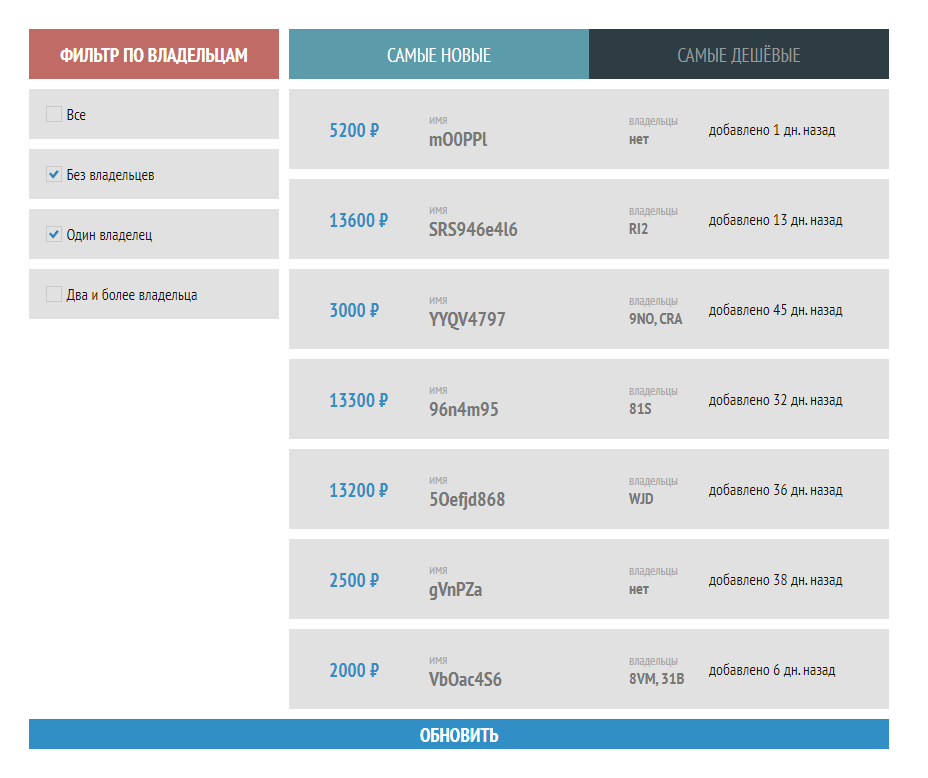

# На основе CRA

- typescrypt
- scss
- адаптивность
- без управления состоянием (redux и т.п.)

## Сложноти

- typescrypt
- фильтры по владельцам

## Запуск

- yarn (npm install)
- yarn start (npm start)

---

---

# Тестовое задание Антивор (Front-end)

## Задача

- Необходимо отобразить компонент, который будет загружать список случайных предметов посредством `api.getItems`
- Реализовать сортировки и фильты согласно макету (сортировка "САМЫЕ НОВЫЕ" по умолчанию)
- При обновлении списка фильтры и сортировки должны сохраняться

## Условия

- Используйте React
- Используйте TS
- Для стилей React-компонентов используйте CSS (scss, less, и пр.)
- Работоспособность в актуальной версии Google Chrome
- Макет предоставлен для понимания отображения, "pixel perfect" и подобное строгое следование макету для выполнения задания не требуется

## Макет

